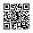

# SciFM Summer School 2024

Scan the following QR code, or visit https://github.com/scifm/summer-school-2024

    

## Tutorials

### Tutorial 2: Tokenization

-  Omics
-  Chemical Data
-  Training Tokenizers
-  Byte Pair Encoding tokenization

### Tutorial 3: Model Architectures

-  GenSLM
-  Vision Transformer
-  Diffusion Models
-  Poseidon: Efficient Models for PDEs
-  NeuralOperators
-  Neural Scaling Laws

## Tutorial 4
-  Retrieval Augmented Generation

## Tutorial 5: Programming Novel AI Accelerators for Scientific Computing

Slides, tutorials, and code for the session are available on ALCF's repo linked above. Tutorials for the accelerators in the [ALCF AI Testbed](https://docs.alcf.anl.gov/ai-testbed/getting-started/) are below:

- [LLMs on Polaris](https://samforeman.me/talks/llms-on-polaris)
- [Cerebras](https://github.com/argonne-lcf/summer-school-2024/blob/main/Cerebras/README.md)  
- [SambaNova](https://github.com/argonne-lcf/summer-school-2024/blob/main/SambaNova/README.md)                                    
- [Graphcore](https://github.com/argonne-lcf/summer-school-2024/blob/main/Graphcore/README.md)  
- [Groq](https://github.com/argonne-lcf/summer-school-2024/blob/main/Groq/README.md)
- [NVIDIA]([./](https://github.com/argonne-lcf/summer-school-2024/blob/main/)Nvidia/README.md)
