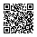

# SciFM Summer School 2024: Introduction to Tokenizing Scientific Data

Scan the following QR code, or visit https://github.com/scifm/intro-to-tokenizers

    

## Notebooks

- Omics 
- Chemical Data 
- Training Tokenizers 
- Byte Pair Encoding tokenization 

## What's here

- `data/` Various (small) datasets for the tutorials

